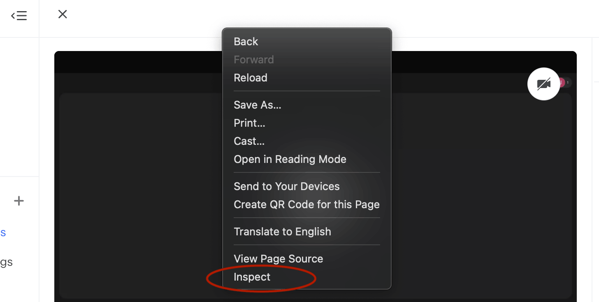
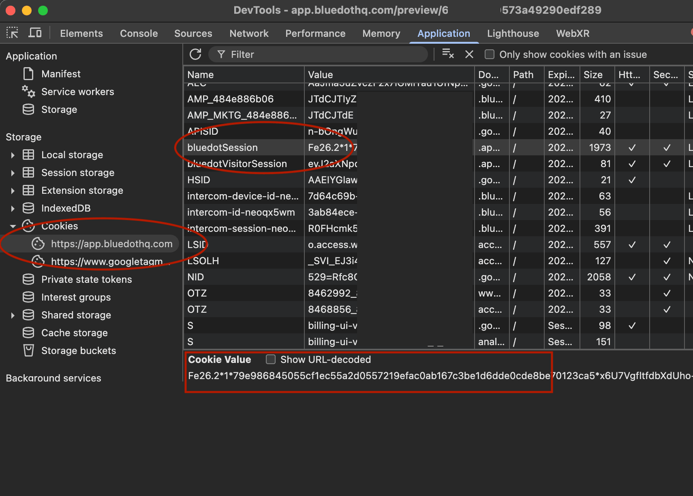

# bluedot-dl

Bulk download videos, transcripts, and meeting summaries from your [BlueDot](https://bluedothq.com) account.

BlueDot is an AI meeting recorder. This tool lets you export your data locally — pick a collection, select which videos you want, and download everything in one go.

## What gets downloaded

For each video, a folder is created containing:

| File | Description |
|---|---|
| `video.webm` | Original video recording |
| `video.txt` | Full transcript with speaker names and timestamps (matches BlueDot's own text export format) |
| `video - Summary.md` | AI-generated meeting summary with overview, action items, and topics |
| `video.json` | Complete metadata from the API |

```
downloads/
└── My Collection/
    ├── Meeting with Alice/
    │   ├── Meeting with Alice.webm
    │   ├── Meeting with Alice.txt
    │   ├── Meeting with Alice - Summary.md
    │   └── Meeting with Alice.json
    ├── Standup Feb 10/
    │   └── ...
```

## Requirements

- A **paid BlueDot plan** (video recordings are not available on the free tier)
- Python 3.10+
- [uv](https://docs.astral.sh/uv/)

## Setup

```bash
git clone https://github.com/blanck/bluedot-dl.git
cd bluedot-dl
uv sync
```

## Usage

```bash
uv run python main.py
```

The interactive interface will guide you through:

1. **Authentication** — BlueDot opens in your browser. Copy the `bluedotSession` cookie (instructions shown in-app), then press Enter. The session is cached in `~/.config/bluedot-dl/session` so you only do this once.
2. **Pick a collection** — Your collections are listed in a table.
3. **Pick videos** — All videos are shown with title, duration, and date. Enter `all` (default) or specific numbers like `1,3,5` or `1-5`.
4. **Download** — Videos download with progress bars. Already-downloaded files are skipped.

### Getting the session cookie

1. Go to [app.bluedothq.com](https://app.bluedothq.com) and sign in
2. Right-click anywhere on the page and click **Inspect** (or press `Cmd+Option+I` on Mac / `F12` on Windows/Linux)

   

3. Go to the **Application** tab → **Cookies** → `https://app.bluedothq.com`
4. Find **`bluedotSession`**, double-click the value, and copy it

   

5. Go back to the terminal and press **Enter** (the tool reads from your clipboard)

## How it works

There is no public BlueDot API. This tool uses the same internal endpoints as the BlueDot web app:

- `GET /api/v1/workspaces` — list workspaces
- `GET /api/v1/workspaces/:id/collections` — list collections
- `GET /api/v1/workspaces/:id/videos?collectionId=:id` — list videos (paginated)
- `GET /api/v1/videos/:id` — video detail with signed download URL, transcript, and summary

Authentication is via the `bluedotSession` cookie (set by BlueDot's WorkOS/Google OAuth flow).

## License

MIT
